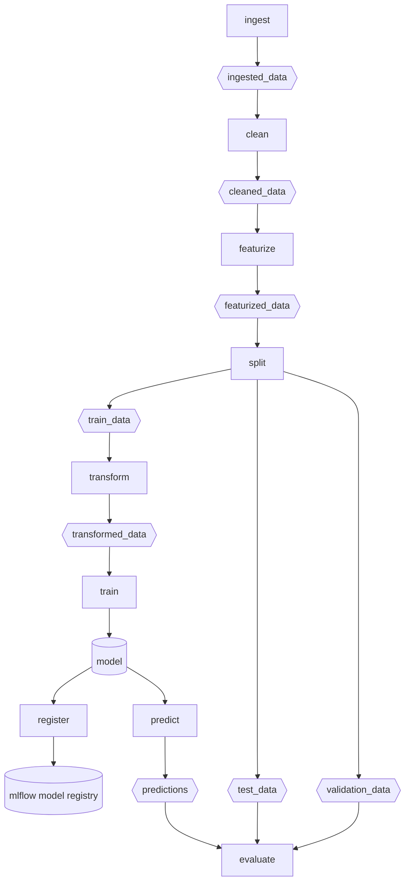
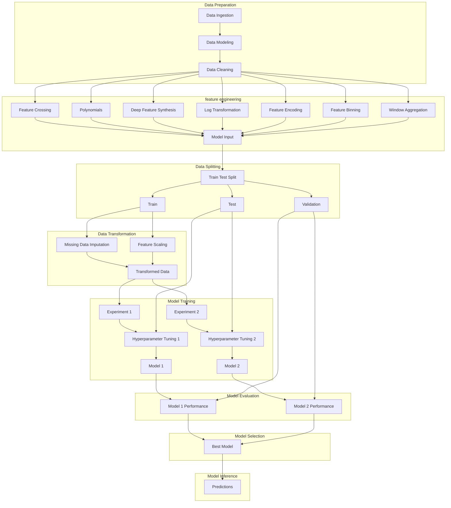

# kaggle-wids-datathon-2020

Kaggle competition for survival analysis, sponsored by Stanford

https://www.kaggle.com/c/widsdatathon2020/

## Description

In advance of the March 2, 2020 Global Women in Data Science (WiDS) Conference, we invite you to build a team, hone your data science skills, and join us in a predictive analytics challenge focused on social impact. Register at bit.ly/WiDSdatathon2020!

The WiDS Datathon 2020 focuses on patient health through data from MIT’s GOSSIS (Global Open Source Severity of Illness Score) initiative. Brought to you by the Global WiDS team, the West Big Data Innovation Hub, and the WiDS Datathon Committee, this year’s datathon is open until February 24, 2020. Winners will be announced at the WiDS Conference at Stanford University and via livestream, reaching a community of 100,000+ data enthusiasts across more than 50 countries.

## Overview

The challenge is to create a model that uses data from the first 24 hours of intensive care to predict patient survival. MIT's GOSSIS community initiative, with privacy certification from the Harvard Privacy Lab, has provided a dataset of more than 130,000 hospital Intensive Care Unit (ICU) visits from patients, spanning a one-year timeframe. This data is part of a growing global effort and consortium spanning Argentina, Australia, New Zealand, Sri Lanka, Brazil, and more than 200 hospitals in the United States.

Labeled training data are provided for model development; you will then upload your predictions for unlabeled data to Kaggle and these predictions will be used to determine the public leaderboard rankings, as well as the final winners of the competition.

Data analysis can be completed using your preferred tools. Tutorials, sample code, and other resources will be posted throughout the competition at widsconference.org/datathon and on the Kaggle Discussion Forum. The winners will be determined by the leaderboard on the Kaggle platform at the time the contest closes February 24.

## Evaluation

Submissions will be evaluated on the Area under the Receiver Operating Characteristic (ROC) curve between the predicted mortality and the observed target (hospital_death).

Learn more about AUC in this developer crash course, this video, or this Kaggle Learn Forum post.
Submission Format

For each encounter_id in the test set, you are asked to explore the columns of data (for example, patient laboratory results, demographics, and vital signs) and create a model for predicting the probability of patient survival.

A hospital_death value of 1 corresponds patient death and a value of 0 corresponds to survival.

Your submission file should contain a header and have the following format:
* encounter_id, hospital_death
* 1, 0.814
* 2, 0.01
* 3, 0.5

etc.

## Prefect

Prefect is a tool for task orchestration that allows for retries after failures in the DAG.

To run the flow, first define the flow in kaggle_prefect_flow.py, then run the following command:

```python
python kaggle_prefect_flow.py
```

To run the Prefect UI to inspect flows and flow runs, run the following command:

```bash
prefect server start
```

After the server is running, navigate to this URI in your browser to view the UI:

- http://127.0.0.1:4200

## SKLearn Pipeline


## MLflow Recipes Classification Template

MLflow has something called [Recipes](https://mlflow.org/docs/latest/recipes.html) that provides a template for a DAG that can be used to train and evaluate a model. These steps happen in a sequence that helps to ensure there is no target leakage and assists with refactoring the data preparation and model training steps into a robust workflow.

The template is shown below:


## Adapting Prefect workflow to MLflow Recipes



## Workflow



## Defining and installing the environment

```bash
mamba env update --file environment.yaml --prune
```

## Using Kaggle API

```bash
kaggle competitions download -c widsdatathon2020
```

```python
import kaggle
import os

os.system('kaggle competitions download -c wids2020 -p .kaggle')

os.system('unzip destination-path/competition-name.zip -d /data/')
```

## Research & Resources

[Khuyen Tran Prefect](https://khuyentran1401.github.io/reproducible-data-science/orchestration/prefect.html)

[Towards Data Science Khuyen Tran Prefect Data Science Orchestration](https://towardsdatascience.com/orchestrate-a-data-science-project-in-python-with-prefect-e69c61a49074)

[Towards Data Science Hydra Tutorial](https://towardsdatascience.com/complete-tutorial-on-how-to-use-hydra-in-machine-learning-projects-1c00efcc5b9b)

## Tools

[Prefect](https://docs.prefect.io/2.14.2/)

[Hydra](https://hydra.cc/)

[Hydra Compose API](https://hydra.cc/docs/next/advanced/compose_api)

[MLflow Recipes](https://mlflow.org/docs/latest/recipes.html)

[scikit-survival GitHub](https://github.com/sebp/scikit-survival)

[scikit-survival docs](https://scikit-survival.readthedocs.io/en/stable/user_guide/00-introduction.html)

[Lifelines](https://lifelines.readthedocs.io/en/latest/)

[PySurvival](https://github.com/square/pysurvival/)

[Survminer](https://rpkgs.datanovia.com/survminer/)
